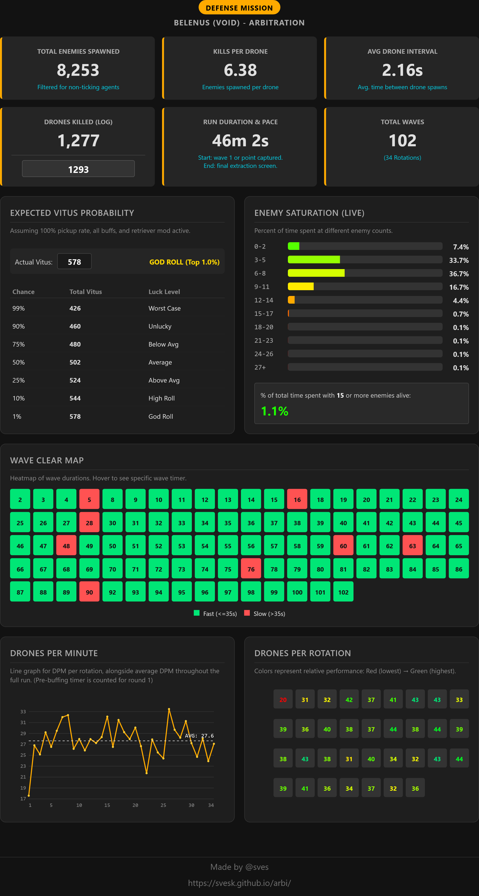
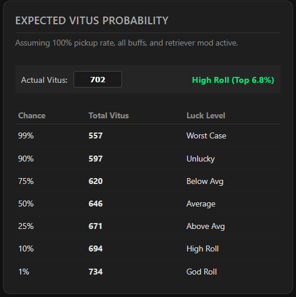
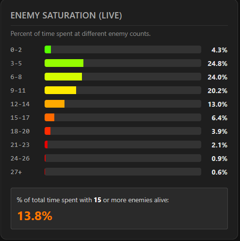
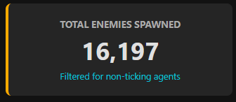

# Warframe Arbitration Log Parser
**Live Tool:** [https://svesk.github.io/arbi/](https://svesk.github.io/arbi/)

---

# 1) What this program does

* Loads a Warframe EE.log in the browser and scans it without loading the whole file into memory.
* Finds relevant events (enemy spawns, drone kills, wave/reward times, and world state).
* Produces easy-to-read stats: total enemies, drones, rounds, run duration, drones-per-minute, and a time-weighted "enemy saturation" breakdown.
* Estimates expected Vitus yields using a simple probabilistic model.

# 2) How the 50% expected Vitus is calculated

The expected Vitus is calculated using 4 variables:

1. The chance for a drone to drop Vitus.
2. The expected Vitus from that drop.
3. The expected Vitus from rotation rewards.
4. The guaranteed Vitus per rotation completion.

**Drone's chance to drop Vitus:**
`6 * 2 * 1.25 = 0.15`  >>> 6% base, 2x for Resource Booster, 1.25x for Resource Drop Chance Blessing.

**Expected Vitus from drone drops:**
`(4 * 0.18) + (2 * (1 - 0.18)) = 2.36`  >>> 18% chance to get 4 Vitus, otherwise 2 Vitus.

**Expected Vitus from rotation rewards:**
`n * (3 * 0.10)`  >>> 10% chance to get 3 Vitus per rotation.

**Guaranteed Vitus:**
`n`  >>> `n` being the number of rotations.

**Results in the following formula:**

* `(number of drones * drop chance * expected Vitus) + (rotations * 0.3) + rotations`
* `(x * 0.15 * 2.36) + (n * 0.3) + n`, where `x` is the number of drones and `n` is the number of rotations.

# 3) How the High Roll and Low Roll (Variance) are calculated

To figure out exactly how lucky or unlucky a run is, we need the Standard Deviation. This is achieved by calculating these things:

1. The variance of a single Vitus drop.
2. The total variance of all drone drops combined (Double RNG).
3. The variance of the rotation rewards.
4. The Standard Deviation (to find the 1% and 99% extremes).

**Variance of a single drop:**
We use the variance formula: `Var(X) = E[X^2] − (E[X])^2`

`((4^2 * 0.18) + (2^2 * 0.82)) - (((4 * 0.18) + (2 * 0.82))^2) = 0.5904`  >>> 18% chance to get 4 squared (16), 82% chance to get 2 squared (4), minus the square of our average drop. This gives us the "wobble" of the Resourceful Retriever.

**Total variance from drones:**
We use the Law of Total Variance formula, which is essentially: `TotalVariance = (MeanDrops * DropVariance) + (MeanDropValue^2 * DropAmountVariance)`

`((x * 0.15) * 0.5904) + ((2.36^2) * (x * 0.15 * 0.85))`  >>> Warframe has double RNG here. We have to account for the RNG of a drone dropping Vitus (15%), AND the RNG of the Resourceful Retriever doubling it (18%).

**Variance from rotation rewards (using binomial variance):**
`n * 0.10 * 0.90 * 9`  >>> 10% chance to get the reward, 90% chance to get nothing, multiplied by the reward squared (`3^2 = 9`).

**The Standard Deviation (σ):**
`sqrt(TotalVariance + RotationVariance)`  >>> We add the two massive variance numbers together and take the Square Root. This gives us our final Standard Deviation (σ), which tells us exactly how wide the bell curve of our luck is.

**Results:**
By using standard Z-Scores (fixed statistical multipliers), we can find the exact boundaries of extreme luck based on our 50% Expected Average (let's call it 'E').

* **1% God Roll:** `E + (2.326 * σ)`  >>> You are insanely lucky. Only 1 in 100 runs will drop more than this.
* **99% Worst Case:** `E + (-2.326 * σ)`  >>> You got robbed by RNG. 99 out of 100 runs will drop more than this.

# 4) How enemy saturation is measured

Enemy saturation measures how "full" the map is during your run. The dashboard derives saturation from the EE.log's `MonitoredTicking` lines and time-weighted segments.

The tool uses 2 inputs:

1. `MonitoredTicking` lines (timestamped live enemy counts).
2. Segment duration (time between consecutive `MonitoredTicking` lines).

**MonitoredTicking (Live Enemies):**
The game regularly checks how many enemies are alive. The tool records each update and how long that enemy count lasted. If the game is paused (like between waves or during reward screens), those times are skipped so your stats only reflect active gameplay.

**Bucketing & weighting:**
Segments are time-weighted and placed into 3-enemy buckets (`0–2`, `3–5`, `6–8`, … up to `27+`). The code uses `STEP = 3` and `MAX_VAL = 30`. For each bucket, the dashboard reports: `percent time = (sum of segment durations in bucket / total included duration) * 100`.

*Why this matters:* A high percentage in upper buckets means the map spends more time near the cap (throttling spawns and reaching the drone cap); a low percentage means you are keeping the map clear for optimized drone spawns.

# 5) How start/end times and rounds are determined

* **Start time:** The analyzer prefers a clear in-game marker (Wave 1 or Interception start). If that is missing, it falls back to the first drone event or a safe approximation.
* **End time:** Taken from the last meaningful activity seen in the log (last drone kill, last wave/reward event). This will almost always be the last extraction screen.
* **Rounds:** Counted when the reward/event UI appears; the tool uses a short debounce to avoid double-counting.
* These start/end and round timestamps are used for mission duration, per-round stats, and drones-per-rotation calculations.

# 6) How total enemies are counted (strict approach)

* Every time a new enemy is logged, the tool tries to count it as a real, unique enemy.
* To avoid inflating the numbers, it checks if that spawn type contributes to the `MonitoredTicking` counter or not. If not, it assumes that spawn is a non-enemy and doesn't count it as an enemy spawn.
* This careful method means the enemy count you see is exclusively every non-ally/killable enemy.
